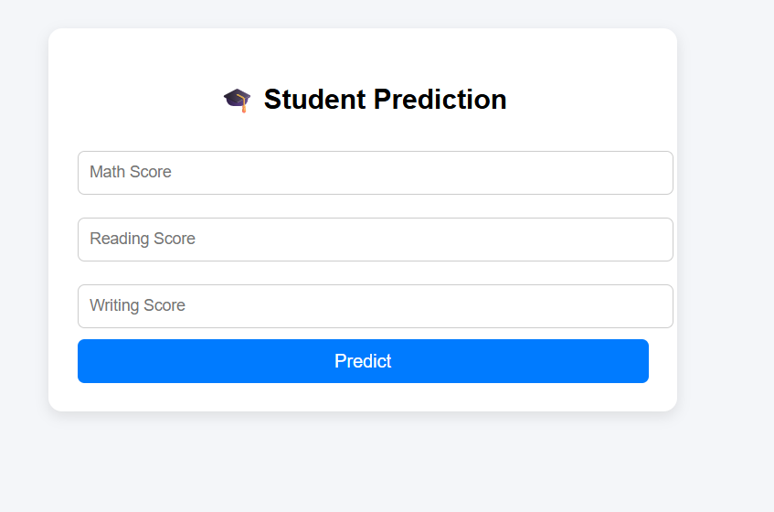
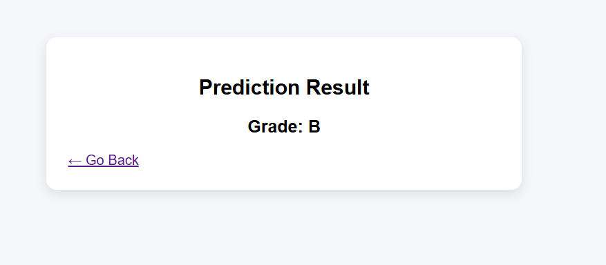
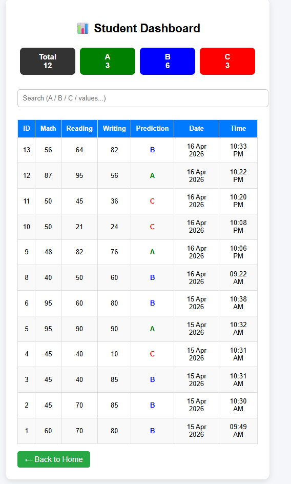

# 🎓 Student Performance Prediction System

- This project is a machine learning-based system that predicts student performance using academic scores such as reading and writing. Multiple models including Logistic Regression, Decision Tree, and Random Forest were trained and compared to select the best-performing model.
- The system predicts student grades (A, B, C) and also identifies at-risk students based on their performance. A simple web interface is used to input data and display predictions.

---

## 🚀 Features

- 📊 Predict student grades (A / B / C)
- ⚠ Identify at-risk students using machine learning
- 🤖 Compare multiple ML algorithms:
  - Logistic Regression
  - Decision Tree
  - Random Forest
- 📈 Evaluate models using:
  - Accuracy
  - Confusion Matrix
  - Classification Report
- 🗄 Store prediction results in MySQL database
- 📋 View prediction history via dashboard

---

## 🧠 Machine Learning Workflow

1. Data Preprocessing  
2. Feature Engineering (average score, grade classification)  
3. Model Training (multiple algorithms)  
4. Model Evaluation  
5. Best Model Selection  
6. Prediction using trained model  

---

## 📁 Project Structure

```
STUDENT_PERFORMANCE_PREDICTION/
│
├── dataset/
│ ├── cleaned_data.csv
│ └── student_data.csv
│
├── model/
│ ├── model.pkl
│ ├── risk_model.pkl
│ ├── predict.py
│ └── train_model.py
│
├── screenshots/
│ ├── input-ui.png
│ ├── prediction-ui.png
│ └── dashboard-ui.png
│
├── web/
│ ├── dashboard.php
│ ├── db.php
│ ├── index.php
│ ├── predict.php
│ └── style.css
│
└── data_preprocessing.py
```

---

## 📸 Screenshots

### 🔹 Input Page


### 🔹 Prediction Output


### 🔹 Dashboard


---

## 🛠 Tech Stack

- **Python** (Pandas, NumPy, Scikit-learn)
- **PHP**
- **MySQL**
- **HTML/CSS**
- **JavaScript (Basic DOM manipulation for filtering)**

---

## ▶️ How to Run the Project

### 1. Clone Repository
```bash
git clone https://github.com/AkarshKumar1/Student_Performance_Prediction.git
```
### 2. Install Python Libraries
```bash
pip install pandas scikit-learn joblib
```
### 3. Train the Model
```bash
python model/train_model.py
```
### 4. Start XAMPP
- Start Apache
- Start MySQL
### 5. Run Project
```bash
http://localhost/Student_Performance_Prediction/web/index.php
```
  

---

📊 Example Output

- Prediction: A
- Prediction: B
- Prediction: C At-Risk Student

---

🧠 Key Learnings

- Implemented end-to-end ML pipeline
- Handled data preprocessing and feature engineering
- Compared multiple ML models
- Evaluated models using classification metrics
- Integrated ML model with backend and database

---

🚀 Future Improvements

- Add advanced visualization (graphs)
- Deploy project online
- Improve UI using Bootstrap
- Add authentication system
